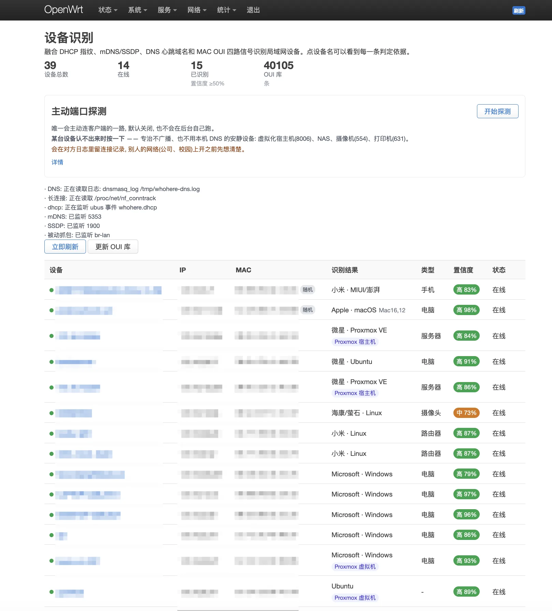
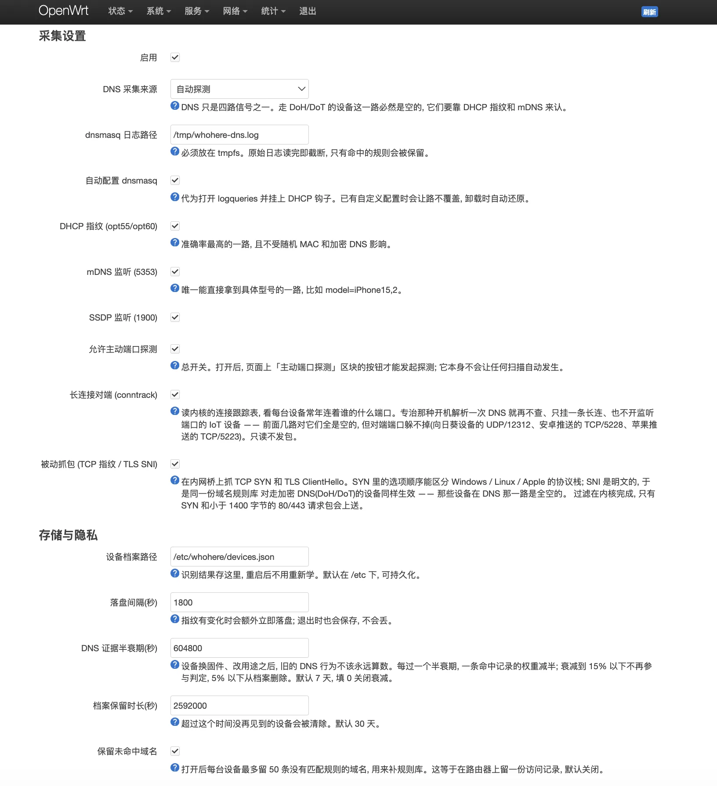

# whohere

看清 OpenWrt 路由器上都挂着谁，以及那都是些什么设备。

传统的「客户端列表」在 iOS 14+ / Android 10+ / Windows 11 默认随机 MAC 之后基本失效了——
你只能看到一串每次连接都变的乱码 MAC。whohere 融合**四路互补信号**做设备识别，
任何一路失效时其余几路还能顶上：

| 信号 | 拿到什么 | 抗随机 MAC | 抗加密 DNS |
|---|---|---|---|
| **DHCP 指纹** (opt55 参数顺序 + opt60 厂商串) | OS 与厂商，准确率最高 | ✅ | ✅ |
| **mDNS / SSDP** 被动监听 | **具体型号串**，如 `Mac16,12`、`iPhone15,2` | ✅ | ✅ |
| **DNS 心跳域名** | 生态归属（苹果/Android/Windows/各家国产） | ✅ | ❌ |
| **MAC OUI** | 网卡厂商 | ❌ | ✅ |

每台设备的判定都附带完整证据链，点开就能看到结论是靠哪几条信号、各占多少权重得出的。





## 安装

```sh
opkg install whohere_*_<你的架构>.ipk luci-app-whohere_*_all.ipk
```

架构用 `opkg print-architecture` 查。二进制是静态 musl，同 CPU 家族可加 `--force-architecture`。
界面在 **服务 → WhoHere**。

装完即用：IEEE OUI 厂商库（4 万条）在构建时就打进包里了，不需要联网初始化。

## 它是怎么工作的

### DHCP 指纹——最可靠的一路

`option 55` 是客户端请求的 DHCP 参数列表，**顺序**因协议栈实现而异，构成指纹；
`option 60` 里很多设备直接自报家门（Android 甚至会写 `android-dhcp-14`，连大版本号都给了）。

拿这两个值有个坑：OpenWrt 的 dnsmasq 跑在 **ujail** 里，`dhcp-script` 是被 `.` source 进去执行的，
除了少数 RW 挂载点之外什么都写不了。所以钩子不能落文件，只能通过 jail 内可用的 ubus 把数据送出来：

```
dnsmasq (jail 内) → dhcp-hook.sh → ubus send whohere.dhcp → whohere daemon
```

### mDNS / SSDP——唯一能直接给出型号的一路

组播天然会送到路由器网卡上，不用抓包也不用主动扫描。Apple 设备在 `_device-info._tcp`
的 TXT 里报 `model=`，Chromecast 报 `md=`，打印机报 `ty=`。
监听套接字带 `SO_REUSEPORT`，可以和已有的 umdns / avahi 共存。

### DNS——辅助信号，且有明确边界

**这一路会漏，而且恰恰最容易漏掉你最想认的新手机**：iOS 17+、Android、Chrome 都可能走
DoH/DoT，dnsmasq 根本看不到查询。所以 DNS 在打分里只是四分之一，不是主力。

规则区分信号强度，这是避免误判的关键：

- `weight 9-10` **心跳**：设备自动发起、几乎只有该品牌会发的。`captive.apple.com`、
  `connectivitycheck.gstatic.com`、`msftconnecttest.com`、`connect.rom.miui.com`……
- `weight 6-8` **云服务**：厂商自家域名。
- `weight 1-3` **网页**：用户主动访问的，纯噪声。**这类信号只能给已经立住的结论加分，
  绝不能自己单独定结论**——否则有人打开一次 microsoft.com，设备就被判成微软的了。

其中一类特别好用的是**系统内置 NTP 服务器**：NTP pool 的厂商专用区
（`android.pool.ntp.org`、`openwrt.pool.ntp.org`、`debian.pool.ntp.org`……）
是编译进系统镜像的，用户几乎不改，且开机必查。

采集来源可切换：

| 来源 | 适用 |
|---|---|
| `dnsmasq_log` | 默认。dnsmasq 是 LAN 解析器时（绝大多数情况，包括前面挂了 sing-box 的） |
| `singbox_log` | sing-box 直接接管了 53 端口时。靠日志里的请求 id 关联 `from <ip>` 和 `dns: exchange` 两行，需要日志级别 debug |
| `dnstap` | unbound / smartdns 等。**dnsmasq 至今不支持 dnstap**，原版 OpenWrt 上这条不会生效 |

日志一律走 tmpfs（`/tmp/whohere-dns.log`），**读完即截断**，只有命中的规则 id 会被留下。
既是隐私要求，也避免磨损闪存。

### 隐私

- 默认**不保存任何原始域名**，只记「命中了哪条规则、命中几次」。
- `keep_unmatched` 打开后才会保留未命中的域名样本（每台最多 50 条，用于补规则），
  这等于在路由器上留一份访问记录，所以默认关闭。
- 识别结果落在 `/etc/whohere/devices.json`，重启不用重新学；原始日志不落持久化分区。

### 随机 MAC 与 OUI

MAC 第一字节的本地管理位为 1 就是随机地址，界面上直接标「随机」，**不拿 OUI 硬猜**。

即便不是随机 MAC，OUI 也**不会被原样当作品牌**——网卡的 OUI 常常是代工厂
（鸿海、世纪新阳之类），原样塞进品牌桶会把「`DESKTOP-xxx` → Windows」这种
真正靠谱的判定挤掉。只有能归一化到消费品牌时才低权重参与打分，否则仅作「网卡厂商」展示。

虚拟化平台（Proxmox / VMware / QEMU……）是**独立于品牌和类型的一维**：
PVE 分配的虚拟网卡只说明这是台虚拟机，里面跑什么系统得靠别的信号定。

## 给其它包用的接口

识别结果是稳定对外契约，`schema` 字段用于判断兼容性（字段只增不删，破坏性改动才 +1）。

**主动查询：**

```sh
ubus call whohere list                        # 全部设备
ubus call whohere detail '{"mac":"aa:bb:.."}' # 单台, 含完整证据链
ubus call whohere status                      # 各采集源状态
```

**订阅变化**（不用轮询，设备被识别出来或结论变化时推送）：

```sh
ubus listen whohere.device
# { "whohere.device": {"schema":1,"reason":"new","mac":"...","brand":"Apple",
#   "os":"macOS","model":"Mac16,12","type":"电脑","confidence":88,...} }
```

`reason` 为 `new`（首次识别出）或 `changed`（结论变化）。

**直接读档案：** `/etc/whohere/devices.json`，键是 MAC。

## 自定义规则

内置规则库 `/usr/share/whohere/rules.json` **随包升级会被覆盖**，自定义规则请写到
`/etc/whohere/rules.local.json`，结构相同，其中的条目优先级更高，升级不会动它。

规则库热加载，改完 60 秒内生效，不用重启。

DHCP 指纹想要大规模覆盖，可以对着 [Fingerbank](https://fingerbank.org/) 的开源库批量导入
`dhcp_fp` 段——本包只带了少量有把握的种子。

## 可选：强制 DNS 回本地

`force_dns` 会把 LAN 的 53 端口 DNAT 回路由器，`block_dot` 连 853(DoT) 一起挡掉，
逼设备退回明文 DNS。**这只能治「自己填了 8.8.8.8」的设备，治不了 DoH**——
那是 443 上的普通 HTTPS，除非按 IP 名单封杀，而那会误伤，所以本包不做。两者默认关闭。

## 配置

`/etc/config/whohere`，或在 LuCI 界面里改。卸载时会自动还原被修改过的 dnsmasq 配置
（`logqueries` / `logfacility` / `dhcpscript`）和防火墙规则；
如果这些项用户本来就配过，本包会让路并记录，不覆盖。

## 构建

```sh
./tools/fetch-oui.sh                                    # 拉 IEEE OUI 表(构建期一次)
TARGET=x86_64-unknown-linux-musl ARCH=x86_64 ./build.sh
```

依赖 `cargo-zigbuild` + `zig`。

## 许可证

[MIT](LICENSE) © wilinz
